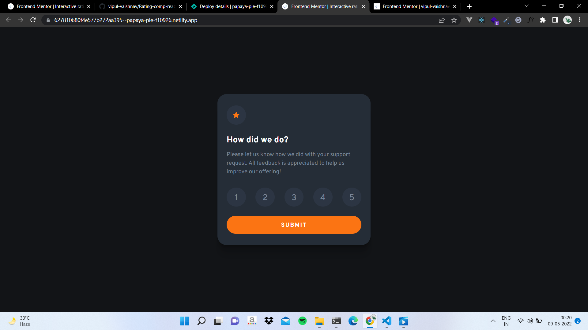

# Frontend Mentor - Interactive rating component solution

This is a solution to the [Interactive rating component challenge on Frontend Mentor](https://www.frontendmentor.io/challenges/interactive-rating-component-koxpeBUmI). Frontend Mentor challenges help you improve your coding skills by building realistic projects.

## Table of contents

- [Overview](#overview)
  - [The challenge](#the-challenge)
  - [Screenshot](#screenshot)
  - [Links](#links)
- [My process](#my-process)
  - [Built with](#built-with)
  - [What I learned](#what-i-learned)
  - [Useful resources](#useful-resources)
- [Author](#author)

## Overview

### The challenge

Users should be able to:

- View the optimal layout for the app depending on their device's screen size
- See hover states for all interactive elements on the page
- Select and submit a number rating
- See the "Thank you" card state after submitting a rating

### Screenshot

Here are the screenshots of the live project

1. State 1 of the project
2. State 2 of the project

### Links

- Solution URL: [Solution URL](https://github.com/vipul-vaishnav/Rating-comp-react)
- Live Site URL: [Live site URL](https://react-ratingcomp.netlify.app/)

## My process

### Built with

- Semantic HTML5 markup
- CSS custom properties
- Flexbox
- Mobile-first workflow
- NPM (package manager)
- [React](https://reactjs.org/) - JS library

### What I learned

While Building this project i learned a lot of things, I learnt about the following things:-

- react hooks
- useState hook
- props and prop drilling
- forms in react
- conditional Rendering

etc.

### Useful resources

- [React Docs](https://reactjs.org/docs/forms.html) - This helped me for better implementation of forms in react

## Author

- Author - _Vipul Vaishnav_
- Frontend Mentor - [@vipul-vaishnav](https://www.frontendmentor.io/profile/vipul-vaishnav)
- Twitter - [@\_\_stfuvipul](https://www.twitter.com/__stfuvipul)
